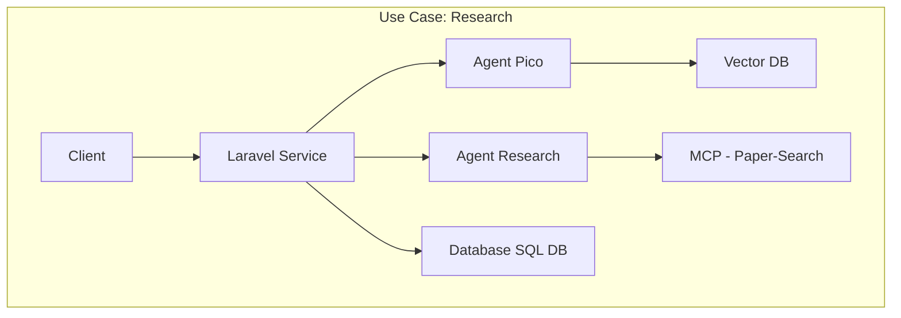
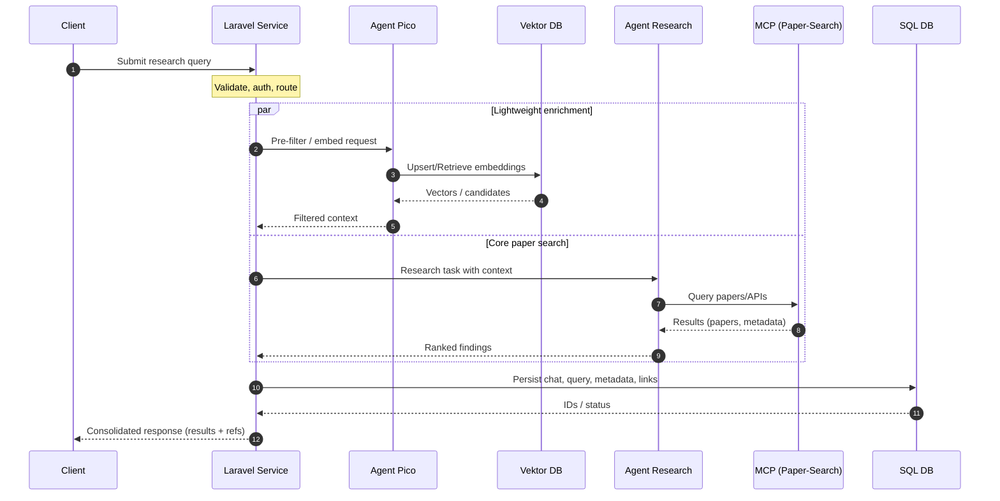
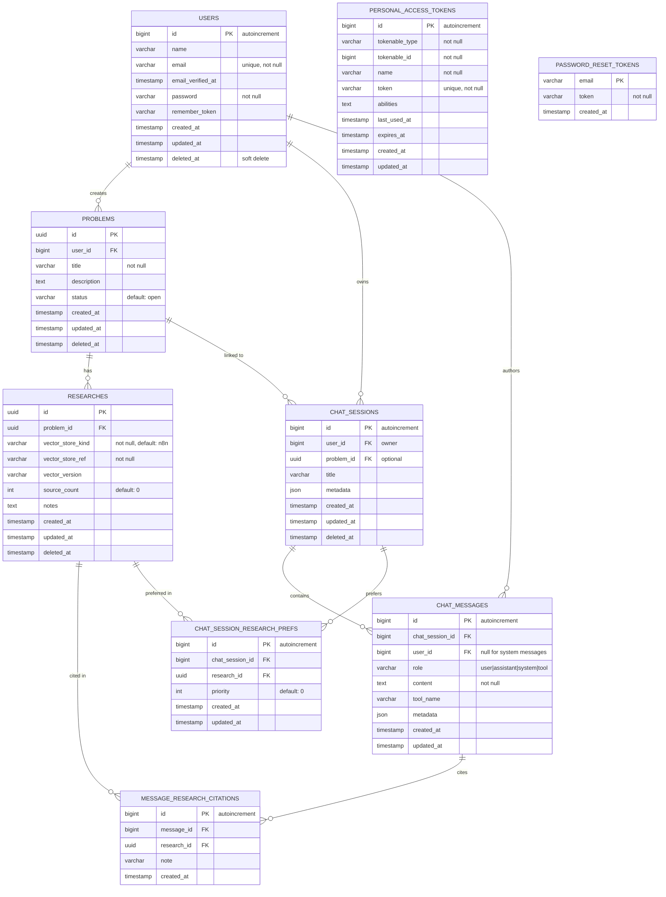
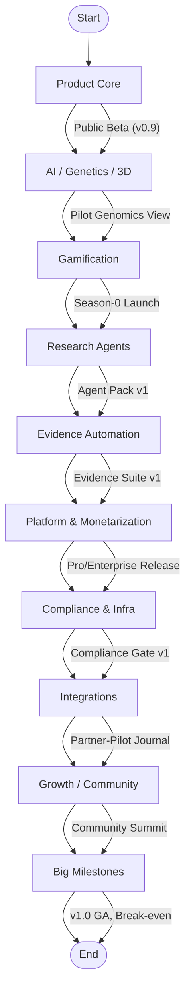

# Laravel 12 Research Bot Database Schema
##Project Structure
### Research Analysis Software Architecture

##Sequence Diagram

## Entity Relationship Diagram

## Note

Vector embeddings live externally (n8n). Only IDs and metadata are stored in this database.

# Research-Bot — 24-Month Roadmap (Flowchart)

