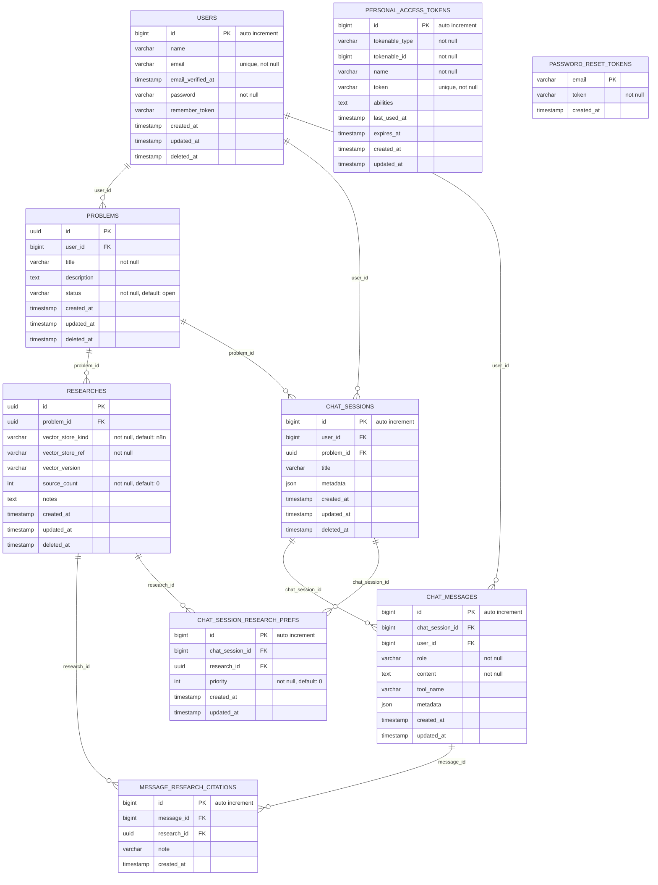

# Laravel 12-ready Core Schema for Research/Chat App

> **Note:** The following schema is not standard Markdown, but a DSL for describing the database structure. For better readability and rendering on GitHub, the schema is visualized as a diagram below.

Vector embeddings are stored externally (n8n). Only IDs and metadata are stored in the database.

//// ---------------------------
//// Enums
//// ---------------------------
Enum message_role {
  user
  assistant
  system
  tool
}

//// ---------------------------
//// Core Auth / Users
//// ---------------------------
Table users {
  id                bigint [pk, increment] // Laravel default
  name              varchar(255)
  email             varchar(255) [not null, unique]
  email_verified_at timestamp [null]
  password          varchar(255) [not null]
  remember_token    varchar(100) [null]
  created_at        timestamp
  updated_at        timestamp
  deleted_at        timestamp [null] // soft delete
}

//// Laravel Sanctum (API tokens)
Table personal_access_tokens {
  id             bigint [pk, increment]
  tokenable_type varchar(255) [not null]
  tokenable_id   bigint [not null]
  name           varchar(255) [not null]
  token          varchar(64)  [not null, unique] // hashed token
  abilities      text [null]
  last_used_at   timestamp [null]
  expires_at     timestamp [null]
  created_at     timestamp
  updated_at     timestamp

  Indexes {
    (tokenable_type, tokenable_id)
  }
}

//// Password reset tokens (Laravel 10/12)
Table password_reset_tokens {
  email      varchar(255) [pk]
  token      varchar(255) [not null]
  created_at timestamp [null]
}

//// ---------------------------
//// Problem & Research (metadata only)
//// ---------------------------
Table problems {
  id          uuid [pk]                       // Business/domain ID (ULID/UUID ok; using UUID here)
  user_id     bigint [not null, ref: > users.id]
  title       varchar(255) [not null]
  description text [null]
  status      varchar(50) [not null, default: 'open'] // open|in_progress|done
  created_at  timestamp
  updated_at  timestamp
  deleted_at  timestamp [null]
  Indexes {
    (user_id)
    (status)
  }
}

Table researches {
  id                   uuid [pk]                         // Business/domain ID for research
  problem_id           uuid [not null, ref: > problems.id]
  vector_store_kind    varchar(50)  [not null, default: 'n8n'] // e.g., 'n8n'
  vector_store_ref     varchar(255) [not null]                 // external identifier (index/collection/id)
  vector_version       varchar(50)  [null]                     // optional version/tag
  source_count         int          [not null, default: 0]
  notes                text         [null]                     // optional notes/summary
  created_at           timestamp
  updated_at           timestamp
  deleted_at           timestamp [null]
  Indexes {
    (problem_id)
    (vector_store_kind, vector_store_ref) [unique]
  }
}

//// ---------------------------
//// Chat Sessions & Messages (chat history)
//// ---------------------------
Table chat_sessions {
  id          bigint [pk, increment]
  user_id     bigint [not null, ref: > users.id] // owner/creator
  problem_id  uuid   [null, ref: > problems.id]  // optional link to a problem
  title       varchar(255) [null]
  metadata    json        [null]                 // free-form small metadata
  created_at  timestamp
  updated_at  timestamp
  deleted_at  timestamp [null]
  Indexes {
    (user_id)
    (problem_id)
  }
}

Table chat_messages {
  id               bigint [pk, increment]
  chat_session_id  bigint [not null, ref: > chat_sessions.id]
  user_id          bigint [null, ref: > users.id]      // null for assistant/system/tool messages
  role             message_role [not null]             // user|assistant|system|tool
  content          text [not null]                     // main message content
  tool_name        varchar(100) [null]                 // filled if role=tool
  metadata         json [null]                         // small per-message metadata (tokens, latency, etc.)
  created_at       timestamp
  updated_at       timestamp
  Indexes {
    (chat_session_id, created_at)
    (user_id)
    (role)
  }
}

//// Messages referencing research items used/cited for the response
Table message_research_citations {
  id          bigint [pk, increment]
  message_id  bigint [not null, ref: > chat_messages.id]
  research_id uuid   [not null, ref: > researches.id]
  note        varchar(255) [null]   // optional: which chunk/section, etc.
  created_at  timestamp
  Indexes {
    (message_id)
    (research_id)
    (message_id, research_id) [unique]
  }
}

//// ---------------------------
//// Optional: tie a chat session to a preferred research set (shortcut)
//// ---------------------------
Table chat_session_research_prefs {
  id              bigint [pk, increment]
  chat_session_id bigint [not null, ref: > chat_sessions.id]
  research_id     uuid   [not null, ref: > researches.id]
  priority        int    [not null, default: 0] // lower = higher priority
  created_at      timestamp
  updated_at      timestamp
  Indexes {
    (chat_session_id)
    (research_id)
    (chat_session_id, research_id) [unique]
    (chat_session_id, priority)
  }
}

//// ---------------------------
//// Foreign Key Graph (explicit Refs for clarity)
//// ---------------------------
Ref: problems.user_id > users.id
Ref: researches.problem_id > problems.id
Ref: chat_sessions.user_id > users.id
Ref: chat_sessions.problem_id > problems.id
Ref: chat_messages.chat_session_id > chat_sessions.id
Ref: chat_messages.user_id > users.id
Ref: message_research_citations.message_id > chat_messages.id
Ref: message_research_citations.research_id > researches.id
Ref: chat_session_research_prefs.chat_session_id > chat_sessions.id
Ref: chat_session_research_prefs.research_id > researches.id
