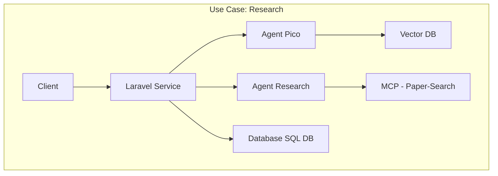
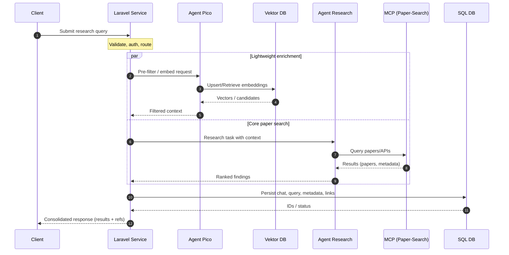
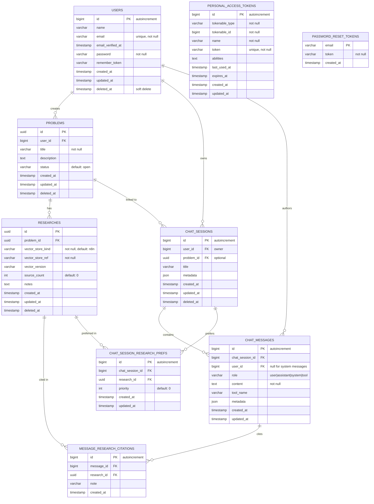

# Laravel 12 Research Bot Database Schema
##Project Structure
### Research Analysis Software Architecture

##Sequence Diagram


## Entity Relationship Diagram



## Note

Vector embeddings live externally (n8n). Only IDs and metadata are stored in this database.


# Research-Bot — 24-Monats-Roadmap (Mermaid)

```mermaid
gantt
    title Research-Bot Roadmap (24 Monate)
    dateFormat  YYYY-MM-DD
    axisFormat  %b %Y
    excludes    weekends

    %% Zeitraum: 2025-11-01 bis 2027-10-31 (Q1–Q8)
    %% Q1 = 2025-11..2026-01, Q2 = 2026-02..04, Q3 = 2026-05..07, Q4 = 2026-08..10
    %% Q5 = 2026-11..2027-01, Q6 = 2027-02..04, Q7 = 2027-05..07, Q8 = 2027-08..10

    section Product Core
    Repo-Hardening (CI, Tests, Lint)       :p1, 2025-11-01, 45d
    Config Layer (env, secrets, presets)   :p2, after p1, 30d
    UX Revamp (Navigation, States)         :p3, after p2, 45d
    Public Beta (v0.9)                     :milestone, 2026-01-31, 0d

    section AI / Genetics / 3D
    PubMed + E-utilities Wrapper           :g1, 2025-11-10, 30d
    BioPython Gene/Variant Extract         :g2, after g1, 45d
    NER/RE Pipeline (Genes/Pathways)       :g3, after g2, 45d
    three.js 3D-Netz (Gene–Paper Graph)    :g4, 2026-02-01, 60d
    3D-Inspector (Filter, Tooltips, Export):g5, after g4, 45d
    Pilot „Genomics View“                  :milestone, gM1, 2026-05-15

    section Gamification
    XP/Badge System (QoQ, Novelty, RoB)    :gm1, 2026-02-05, 45d
    Co-op Quests (Team-Dungeons)           :gm2, after gm1, 45d
    Boss-Fights = Meta-Analyse Challenges  :gm3, after gm2, 30d
    Season-0 Launch                        :milestone, gmM1, 2026-06-30

    section Research Agents
    Reviewer-Sim Agent (LLM Critique)      :a1, 2026-05-20, 45d
    Grant-Scanner Agent                     :a2, after a1, 30d
    Multi-Agent Debate (consensus)          :a3, after a2, 45d
    Agent SDK (hooks, tools, eval)          :a4, after a3, 45d
    Agent Pack v1                           :milestone, aM1, 2026-12-15

    section Evidence Automation
    Auto-PRISMA & GRADE Generator           :e1, 2026-03-01, 45d
    Risk-of-Bias Templates                  :e2, after e1, 30d
    OSF/ClinicalTrials Pre-Reg Export       :e3, after e2, 45d
    Evidence Suite v1                       :milestone, eM1, 2026-10-31

    section Platform & Monetarisierung
    Template-Marktplatz (PICO, Pipelines)   :m1, 2026-08-01, 45d
    Billing (Stripe) & Plan Logic           :m2, after m1, 30d
    Org Workspaces & RBAC                   :m3, after m2, 45d
    Pro/Enterprise Release                  :milestone, mM1, 2027-02-15

    section Compliance & Infra
    Audit Trail (immutable logs)            :c1, 2026-05-01, 45d
    PHI/PII Safe-Mode & Redaction           :c2, after c1, 45d
    Model Card + Eval Bench                 :c3, after c2, 30d
    SOC2-readiness Toolkit                  :c4, after c3, 60d
    Compliance Gate v1                      :milestone, cM1, 2027-06-30

    section Integrationen
    n8n Nodes (search/fetch/parse)          :i1, 2025-12-01, 30d
    GraphQL Layer (Hypothesen-Netz)         :i2, 2026-04-15, 45d
    Publisher Widgets (Embeds, WebGL)       :i3, after i2, 45d
    Partner-Pilot mit Journal               :milestone, iM1, 2026-11-30

    section Growth / Community
    Education Tracks (Badges, Kurse)        :gr1, 2026-09-01, 60d
    Prediction Market (Replizierbarkeit)    :gr2, 2027-03-01, 60d
    Community Summit                        :milestone, grM1, 2027-07-15

    section Big Milestones
    v1.0 GA                                 :milestone, v1, 2027-03-31
    10 Design-Partner live                  :milestone, dp10, 2027-08-31
    Break-even Ziel                         :milestone, be1, 2027-10-31
```