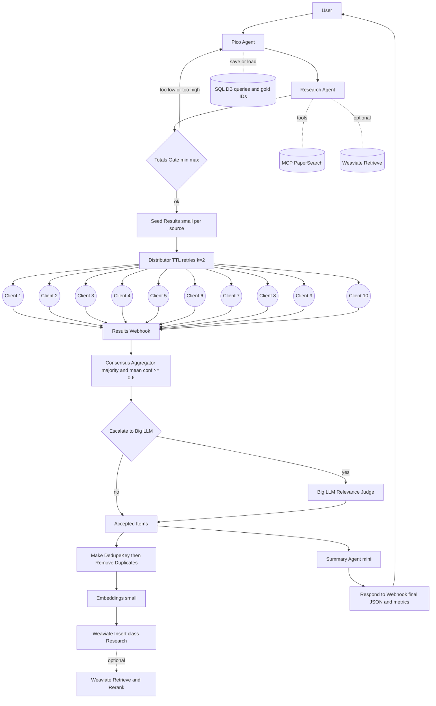

```mermaid
flowchart TB
  U[User] --> PA[Pico Agent]
  PA --> RA[Research Agent]

  RA --> TG{Totals Gate min max}
  TG -- too low or too high --> PA
  TG -- ok --> RS[Seed Results small per source]

  RS --> ORCH[Distributor TTL retries k=2]
  ORCH --> V1((Client 1))
  ORCH --> V2((Client 2))
  ORCH --> V3((Client 3))
  ORCH --> V4((Client 4))
  ORCH --> V5((Client 5))
  ORCH --> V6((Client 6))
  ORCH --> V7((Client 7))
  ORCH --> V8((Client 8))
  ORCH --> V9((Client 9))
  ORCH --> V10((Client 10))

  V1 --> RW[Results Webhook]
  V2 --> RW
  V3 --> RW
  V4 --> RW
  V5 --> RW
  V6 --> RW
  V7 --> RW
  V8 --> RW
  V9 --> RW
  V10 --> RW

  RW --> CONS[Consensus Aggregator majority and mean conf >= 0.6]
  CONS --> GB{Escalate to Big LLM}
  GB -- yes --> BL[Big LLM Relevance Judge]
  GB -- no  --> PASS[Accepted Items]
  BL --> PASS

  PASS --> DED[Make DedupeKey then Remove Duplicates]
  DED --> EMB[Embeddings small]
  EMB --> WINS[Weaviate Insert class Research]
  WINS -. optional .-> WR[Weaviate Retrieve and Rerank]

  PASS --> SUMM[Summary Agent mini]
  SUMM --> OUT[Respond to Webhook final JSON and metrics]
  OUT --> U

  RA -. tools .- MCP[(MCP PaperSearch)]
  RA -. optional .- WRET[(Weaviate Retrieve)]
  PA -. save or load .- SQL[(SQL DB queries and gold IDs)]

```
